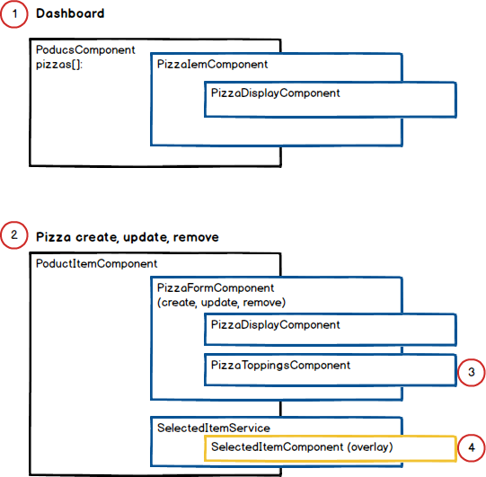

# SpectatorPizza211001

This project was generated with [Angular CLI](https://github.com/angular/angular-cli) version 12.2.0.

## Summary
* In this program, part of the original image is referenced in another Article,
  Sample program developed with Angular: (Angular source: https://github.com/cypress-io/angular-pizza-creator).
* A program that stopped while trying to develop by combining Redux (NgXS) and RxJS:
  (<a href="https://github.com/tommythongnguyen/Ngxs-Pizza-Order">https://github.com/tommythongnguyen/Ngxs-Pizza-Order
* This program has been reinforcing and revising the overall function, such as correcting and completing important parts and adding/deleting toppings.
  Originally, it works by being connected to the DB, but it operates instead as a Redux function for online demonstration.
* The source of the program can be easily grasped systematically and is easily maintained.
### Applied technology
* NgXS: (Redux for Angular) : Apply Redux to change the state of each module of the program in one place
  Because it is managed, it is easy to manage the status, and it is easy to expand functions and maintain maintenance.
* Angular Material : Basic components (button, input, card, etc.) and table are applied
* Angular Cdk : Implementation of expressing selected toppings with Angular Cdk Overlay technology.
  As an overlay function, Data can be expressed without affecting the data in the background.
* RxJS : All major functions of the program are applied RxJS to improve productivity and maintainability.
* Angular Animation : Toppings on pizza dough by applying Angular Animation function
  improve the implementation vividly. (The content that was implemented in the original version)
### Basic structure

Below seq. no is related with above diagram.
~~~
1. Main screen, Program to display made pizzas
2. Structure for each pizza
3. Programs related to pizza toppings
4. A program that selects pizza toppings and displays the overlay process for the selected toppings
~~~
### Description of Program Source
* pizza-display ; A component that animates toppings on pizza dough.
* pizza-form: A component that creates, adds, or deletes pizzas, or selects and saves toppings.
* pizza-item: A component that displays pizza on the dashboard (home menu).
* pizza-toppings: Ability to choose toppings for pizza. Delivers the selected result to pizza-form component
* Selected-item: A component that displays the selected topping and calculates a price
  that fluctuates whenever a topping is added or removed.
* product-item.componet: Components that display separately if you select a pizza listed on the dashboard.
* product.component: The part that lists the created pizza on the dashboard (home menu)

#### Deploy information

1. ng build --base-href "https://wsjung0516.github.io/pizza-order220304/"
2. ng add angular-cli-ghpages
3. npx ngh --dir=dist/pizza-order220304
   if above command is not working, please refer following site --> https://github.com/angular-schule/angular-cli-ghpages
